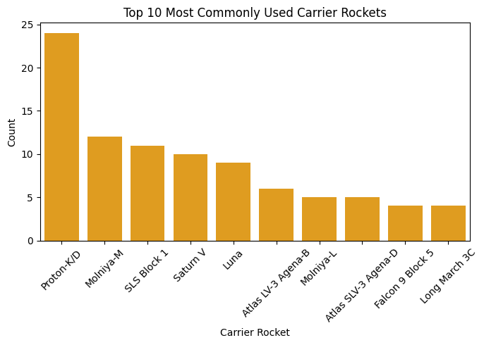
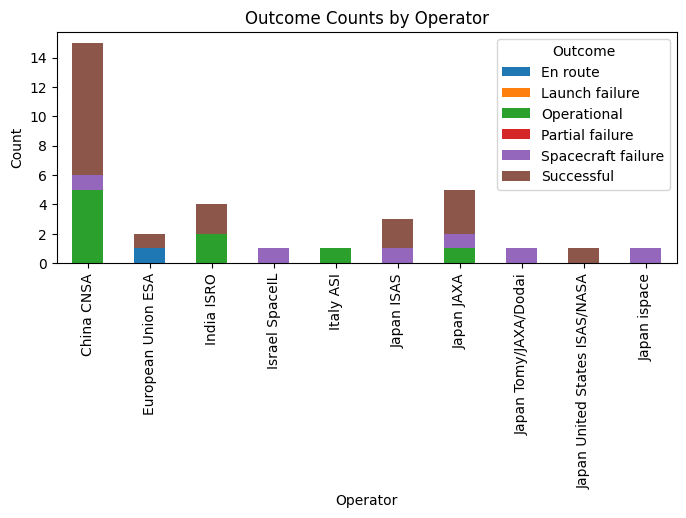

# Moon-Landing-Data-Analysis
Here I am doing analysis on the dataset "Moon Landings" - https://www.kaggle.com/datasets/anoopjohny/moon-landings/code

##### Importing all the libraries


```python
import numpy as np
import pandas as pd
import matplotlib.pyplot as plt
import os
import seaborn as sns
import plotly.express as px
import plotly.graph_objects as go
```

##### Make the DataFrame


```python
moon_dataframe=pd.read_csv("Moonlanding.csv", 
                           encoding='latin-1')
moon_dataframe.head()
```


<div>
<style scoped>
    .dataframe tbody tr th:only-of-type {
        vertical-align: middle;
    }

    .dataframe tbody tr th {
        vertical-align: top;
    }

    .dataframe thead th {
        text-align: right;
    }
</style>
<table border="1" class="dataframe">
  <thead>
    <tr style="text-align: right;">
      <th></th>
      <th>Mission</th>
      <th>Spacecraft</th>
      <th>Launch Date</th>
      <th>Carrier Rocket</th>
      <th>Operator</th>
      <th>Mission Type</th>
      <th>Outcome</th>
      <th>Additional Information</th>
    </tr>
  </thead>
  <tbody>
    <tr>
      <th>0</th>
      <td>Pioneer 0 (Able I)</td>
      <td>Pioneer 0</td>
      <td>17-Aug-58</td>
      <td>Thor DM-18 Able I</td>
      <td>United States USAF</td>
      <td>Orbiter</td>
      <td>Launch failure</td>
      <td>First attempted launch beyond Earth orbit; fai...</td>
    </tr>
    <tr>
      <th>1</th>
      <td>Luna E-1 No.1</td>
      <td>Luna E-1 No.1</td>
      <td>23-Sep-58</td>
      <td>Luna</td>
      <td>Soviet Union OKB-1</td>
      <td>Impactor</td>
      <td>Launch failure</td>
      <td>Failed to orbit; rocket disintegrated due to e...</td>
    </tr>
    <tr>
      <th>2</th>
      <td>Pioneer 1 (Able II)</td>
      <td>Pioneer 1</td>
      <td>11-Oct-58</td>
      <td>Thor DM-18 Able I</td>
      <td>United States NASA</td>
      <td>Orbiter</td>
      <td>Launch failure</td>
      <td>Failed to orbit; premature second-stage cutoff...</td>
    </tr>
    <tr>
      <th>3</th>
      <td>Luna E-1 No.2</td>
      <td>Luna E-1 No.2</td>
      <td>11-Oct-58</td>
      <td>Luna</td>
      <td>Soviet Union OKB-1</td>
      <td>Impactor</td>
      <td>Launch failure</td>
      <td>Failed to orbit; carrier rocket exploded due t...</td>
    </tr>
    <tr>
      <th>4</th>
      <td>Pioneer 2 (Able III)</td>
      <td>Pioneer 2</td>
      <td>8-Nov-58</td>
      <td>Thor DM-18 Able I</td>
      <td>United States NASA</td>
      <td>Orbiter</td>
      <td>Launch failure</td>
      <td>Failed to orbit; premature second-stage cutoff...</td>
    </tr>
  </tbody>
</table>
</div>


```python
moon_dataframe.info()
```

    <class 'pandas.core.frame.DataFrame'>
    RangeIndex: 158 entries, 0 to 157
    Data columns (total 8 columns):
     #   Column                  Non-Null Count  Dtype 
    ---  ------                  --------------  ----- 
     0   Mission                 158 non-null    object
     1   Spacecraft              158 non-null    object
     2   Launch Date             158 non-null    object
     3   Carrier Rocket          158 non-null    object
     4   Operator                158 non-null    object
     5   Mission Type            158 non-null    object
     6   Outcome                 158 non-null    object
     7   Additional Information  157 non-null    object
    dtypes: object(8)
    memory usage: 10.0+ KB
    

#### <span style = 'color:blue'>Exploratory Data Analysis</span>

##### Distribution of "what was the outcome of the mission?"


```python
outcome_distribution = moon_dataframe['Outcome'].value_counts()
fig_outcome = px.bar(outcome_distribution, 
                     x=outcome_distribution.index, 
                     y=outcome_distribution.values, 
                     labels={'x': 'Outcome', 'y': 'Count'}, 
                     title='Distribution of Mission Outcomes',
                     color=outcome_distribution.index)  
fig_outcome.show()
```


<div>                            <div id="444d22b8-31af-4293-8da7-8f145a27579e" class="plotly-graph-div" style="height:525px; width:100%;"></div>            <script type="text/javascript">                require(["plotly"], function(Plotly) {                    window.PLOTLYENV=window.PLOTLYENV || {};                                    if (document.getElementById("444d22b8-31af-4293-8da7-8f145a27579e")) {                    Plotly.newPlot(                        "444d22b8-31af-4293-8da7-8f145a27579e",                        [{"alignmentgroup":"True","hovertemplate":"Outcome=%{x}\u003cbr\u003eCount=%{y}\u003cextra\u003e\u003c\u002fextra\u003e","legendgroup":"Successful","marker":{"color":"#636efa","pattern":{"shape":""}},"name":"Successful","offsetgroup":"Successful","orientation":"v","showlegend":true,"textposition":"auto","x":["Successful"],"xaxis":"x","y":[78],"yaxis":"y","type":"bar"},{"alignmentgroup":"True","hovertemplate":"Outcome=%{x}\u003cbr\u003eCount=%{y}\u003cextra\u003e\u003c\u002fextra\u003e","legendgroup":"Launch failure","marker":{"color":"#EF553B","pattern":{"shape":""}},"name":"Launch failure","offsetgroup":"Launch failure","orientation":"v","showlegend":true,"textposition":"auto","x":["Launch failure"],"xaxis":"x","y":[31],"yaxis":"y","type":"bar"},{"alignmentgroup":"True","hovertemplate":"Outcome=%{x}\u003cbr\u003eCount=%{y}\u003cextra\u003e\u003c\u002fextra\u003e","legendgroup":"Spacecraft failure","marker":{"color":"#00cc96","pattern":{"shape":""}},"name":"Spacecraft failure","offsetgroup":"Spacecraft failure","orientation":"v","showlegend":true,"textposition":"auto","x":["Spacecraft failure"],"xaxis":"x","y":[28],"yaxis":"y","type":"bar"},{"alignmentgroup":"True","hovertemplate":"Outcome=%{x}\u003cbr\u003eCount=%{y}\u003cextra\u003e\u003c\u002fextra\u003e","legendgroup":"Operational","marker":{"color":"#ab63fa","pattern":{"shape":""}},"name":"Operational","offsetgroup":"Operational","orientation":"v","showlegend":true,"textposition":"auto","x":["Operational"],"xaxis":"x","y":[14],"yaxis":"y","type":"bar"},{"alignmentgroup":"True","hovertemplate":"Outcome=%{x}\u003cbr\u003eCount=%{y}\u003cextra\u003e\u003c\u002fextra\u003e","legendgroup":"Partial failure","marker":{"color":"#FFA15A","pattern":{"shape":""}},"name":"Partial failure","offsetgroup":"Partial failure","orientation":"v","showlegend":true,"textposition":"auto","x":["Partial failure"],"xaxis":"x","y":[6],"yaxis":"y","type":"bar"},{"alignmentgroup":"True","hovertemplate":"Outcome=%{x}\u003cbr\u003eCount=%{y}\u003cextra\u003e\u003c\u002fextra\u003e","legendgroup":"En route","marker":{"color":"#19d3f3","pattern":{"shape":""}},"name":"En route","offsetgroup":"En route","orientation":"v","showlegend":true,"textposition":"auto","x":["En route"],"xaxis":"x","y":[1],"yaxis":"y","type":"bar"}],                        {"template":{"data":{"histogram2dcontour":[{"type":"histogram2dcontour","colorbar":{"outlinewidth":0,"ticks":""},"colorscale":[[0.0,"#0d0887"],[0.1111111111111111,"#46039f"],[0.2222222222222222,"#7201a8"],[0.3333333333333333,"#9c179e"],[0.4444444444444444,"#bd3786"],[0.5555555555555556,"#d8576b"],[0.6666666666666666,"#ed7953"],[0.7777777777777778,"#fb9f3a"],[0.8888888888888888,"#fdca26"],[1.0,"#f0f921"]]}],"choropleth":[{"type":"choropleth","colorbar":{"outlinewidth":0,"ticks":""}}],"histogram2d":[{"type":"histogram2d","colorbar":{"outlinewidth":0,"ticks":""},"colorscale":[[0.0,"#0d0887"],[0.1111111111111111,"#46039f"],[0.2222222222222222,"#7201a8"],[0.3333333333333333,"#9c179e"],[0.4444444444444444,"#bd3786"],[0.5555555555555556,"#d8576b"],[0.6666666666666666,"#ed7953"],[0.7777777777777778,"#fb9f3a"],[0.8888888888888888,"#fdca26"],[1.0,"#f0f921"]]}],"heatmap":[{"type":"heatmap","colorbar":{"outlinewidth":0,"ticks":""},"colorscale":[[0.0,"#0d0887"],[0.1111111111111111,"#46039f"],[0.2222222222222222,"#7201a8"],[0.3333333333333333,"#9c179e"],[0.4444444444444444,"#bd3786"],[0.5555555555555556,"#d8576b"],[0.6666666666666666,"#ed7953"],[0.7777777777777778,"#fb9f3a"],[0.8888888888888888,"#fdca26"],[1.0,"#f0f921"]]}],"heatmapgl":[{"type":"heatmapgl","colorbar":{"outlinewidth":0,"ticks":""},"colorscale":[[0.0,"#0d0887"],[0.1111111111111111,"#46039f"],[0.2222222222222222,"#7201a8"],[0.3333333333333333,"#9c179e"],[0.4444444444444444,"#bd3786"],[0.5555555555555556,"#d8576b"],[0.6666666666666666,"#ed7953"],[0.7777777777777778,"#fb9f3a"],[0.8888888888888888,"#fdca26"],[1.0,"#f0f921"]]}],"contourcarpet":[{"type":"contourcarpet","colorbar":{"outlinewidth":0,"ticks":""}}],"contour":[{"type":"contour","colorbar":{"outlinewidth":0,"ticks":""},"colorscale":[[0.0,"#0d0887"],[0.1111111111111111,"#46039f"],[0.2222222222222222,"#7201a8"],[0.3333333333333333,"#9c179e"],[0.4444444444444444,"#bd3786"],[0.5555555555555556,"#d8576b"],[0.6666666666666666,"#ed7953"],[0.7777777777777778,"#fb9f3a"],[0.8888888888888888,"#fdca26"],[1.0,"#f0f921"]]}],"surface":[{"type":"surface","colorbar":{"outlinewidth":0,"ticks":""},"colorscale":[[0.0,"#0d0887"],[0.1111111111111111,"#46039f"],[0.2222222222222222,"#7201a8"],[0.3333333333333333,"#9c179e"],[0.4444444444444444,"#bd3786"],[0.5555555555555556,"#d8576b"],[0.6666666666666666,"#ed7953"],[0.7777777777777778,"#fb9f3a"],[0.8888888888888888,"#fdca26"],[1.0,"#f0f921"]]}],"mesh3d":[{"type":"mesh3d","colorbar":{"outlinewidth":0,"ticks":""}}],"scatter":[{"fillpattern":{"fillmode":"overlay","size":10,"solidity":0.2},"type":"scatter"}],"parcoords":[{"type":"parcoords","line":{"colorbar":{"outlinewidth":0,"ticks":""}}}],"scatterpolargl":[{"type":"scatterpolargl","marker":{"colorbar":{"outlinewidth":0,"ticks":""}}}],"bar":[{"error_x":{"color":"#2a3f5f"},"error_y":{"color":"#2a3f5f"},"marker":{"line":{"color":"#E5ECF6","width":0.5},"pattern":{"fillmode":"overlay","size":10,"solidity":0.2}},"type":"bar"}],"scattergeo":[{"type":"scattergeo","marker":{"colorbar":{"outlinewidth":0,"ticks":""}}}],"scatterpolar":[{"type":"scatterpolar","marker":{"colorbar":{"outlinewidth":0,"ticks":""}}}],"histogram":[{"marker":{"pattern":{"fillmode":"overlay","size":10,"solidity":0.2}},"type":"histogram"}],"scattergl":[{"type":"scattergl","marker":{"colorbar":{"outlinewidth":0,"ticks":""}}}],"scatter3d":[{"type":"scatter3d","line":{"colorbar":{"outlinewidth":0,"ticks":""}},"marker":{"colorbar":{"outlinewidth":0,"ticks":""}}}],"scattermapbox":[{"type":"scattermapbox","marker":{"colorbar":{"outlinewidth":0,"ticks":""}}}],"scatterternary":[{"type":"scatterternary","marker":{"colorbar":{"outlinewidth":0,"ticks":""}}}],"scattercarpet":[{"type":"scattercarpet","marker":{"colorbar":{"outlinewidth":0,"ticks":""}}}],"carpet":[{"aaxis":{"endlinecolor":"#2a3f5f","gridcolor":"white","linecolor":"white","minorgridcolor":"white","startlinecolor":"#2a3f5f"},"baxis":{"endlinecolor":"#2a3f5f","gridcolor":"white","linecolor":"white","minorgridcolor":"white","startlinecolor":"#2a3f5f"},"type":"carpet"}],"table":[{"cells":{"fill":{"color":"#EBF0F8"},"line":{"color":"white"}},"header":{"fill":{"color":"#C8D4E3"},"line":{"color":"white"}},"type":"table"}],"barpolar":[{"marker":{"line":{"color":"#E5ECF6","width":0.5},"pattern":{"fillmode":"overlay","size":10,"solidity":0.2}},"type":"barpolar"}],"pie":[{"automargin":true,"type":"pie"}]},"layout":{"autotypenumbers":"strict","colorway":["#636efa","#EF553B","#00cc96","#ab63fa","#FFA15A","#19d3f3","#FF6692","#B6E880","#FF97FF","#FECB52"],"font":{"color":"#2a3f5f"},"hovermode":"closest","hoverlabel":{"align":"left"},"paper_bgcolor":"white","plot_bgcolor":"#E5ECF6","polar":{"bgcolor":"#E5ECF6","angularaxis":{"gridcolor":"white","linecolor":"white","ticks":""},"radialaxis":{"gridcolor":"white","linecolor":"white","ticks":""}},"ternary":{"bgcolor":"#E5ECF6","aaxis":{"gridcolor":"white","linecolor":"white","ticks":""},"baxis":{"gridcolor":"white","linecolor":"white","ticks":""},"caxis":{"gridcolor":"white","linecolor":"white","ticks":""}},"coloraxis":{"colorbar":{"outlinewidth":0,"ticks":""}},"colorscale":{"sequential":[[0.0,"#0d0887"],[0.1111111111111111,"#46039f"],[0.2222222222222222,"#7201a8"],[0.3333333333333333,"#9c179e"],[0.4444444444444444,"#bd3786"],[0.5555555555555556,"#d8576b"],[0.6666666666666666,"#ed7953"],[0.7777777777777778,"#fb9f3a"],[0.8888888888888888,"#fdca26"],[1.0,"#f0f921"]],"sequentialminus":[[0.0,"#0d0887"],[0.1111111111111111,"#46039f"],[0.2222222222222222,"#7201a8"],[0.3333333333333333,"#9c179e"],[0.4444444444444444,"#bd3786"],[0.5555555555555556,"#d8576b"],[0.6666666666666666,"#ed7953"],[0.7777777777777778,"#fb9f3a"],[0.8888888888888888,"#fdca26"],[1.0,"#f0f921"]],"diverging":[[0,"#8e0152"],[0.1,"#c51b7d"],[0.2,"#de77ae"],[0.3,"#f1b6da"],[0.4,"#fde0ef"],[0.5,"#f7f7f7"],[0.6,"#e6f5d0"],[0.7,"#b8e186"],[0.8,"#7fbc41"],[0.9,"#4d9221"],[1,"#276419"]]},"xaxis":{"gridcolor":"white","linecolor":"white","ticks":"","title":{"standoff":15},"zerolinecolor":"white","automargin":true,"zerolinewidth":2},"yaxis":{"gridcolor":"white","linecolor":"white","ticks":"","title":{"standoff":15},"zerolinecolor":"white","automargin":true,"zerolinewidth":2},"scene":{"xaxis":{"backgroundcolor":"#E5ECF6","gridcolor":"white","linecolor":"white","showbackground":true,"ticks":"","zerolinecolor":"white","gridwidth":2},"yaxis":{"backgroundcolor":"#E5ECF6","gridcolor":"white","linecolor":"white","showbackground":true,"ticks":"","zerolinecolor":"white","gridwidth":2},"zaxis":{"backgroundcolor":"#E5ECF6","gridcolor":"white","linecolor":"white","showbackground":true,"ticks":"","zerolinecolor":"white","gridwidth":2}},"shapedefaults":{"line":{"color":"#2a3f5f"}},"annotationdefaults":{"arrowcolor":"#2a3f5f","arrowhead":0,"arrowwidth":1},"geo":{"bgcolor":"white","landcolor":"#E5ECF6","subunitcolor":"white","showland":true,"showlakes":true,"lakecolor":"white"},"title":{"x":0.05},"mapbox":{"style":"light"}}},"xaxis":{"anchor":"y","domain":[0.0,1.0],"title":{"text":"Outcome"},"categoryorder":"array","categoryarray":["Successful","Launch failure","Spacecraft failure","Operational","Partial failure","En route"]},"yaxis":{"anchor":"x","domain":[0.0,1.0],"title":{"text":"Count"}},"legend":{"title":{"text":"Outcome"},"tracegroupgap":0},"title":{"text":"Distribution of Mission Outcomes"},"barmode":"relative"},                        {"responsive": true}                    ).then(function(){

var gd = document.getElementById('444d22b8-31af-4293-8da7-8f145a27579e');
var x = new MutationObserver(function (mutations, observer) {{
        var display = window.getComputedStyle(gd).display;
        if (!display || display === 'none') {{
            console.log([gd, 'removed!']);
            Plotly.purge(gd);
            observer.disconnect();
        }}
}});

// Listen for the removal of the full notebook cells
var notebookContainer = gd.closest('#notebook-container');
if (notebookContainer) {{
    x.observe(notebookContainer, {childList: true});
}}

// Listen for the clearing of the current output cell
var outputEl = gd.closest('.output');
if (outputEl) {{
    x.observe(outputEl, {childList: true});
}}

                        })                };                });            </script>        </div>


##### Distribution of "what were the types of missions?"


```python
mission_type_distribution = moon_dataframe['Mission Type'].value_counts()
fig_mission_type = px.bar(mission_type_distribution, 
                          y=mission_type_distribution.index, 
                          x=mission_type_distribution.values, 
                          orientation='h', 
                          labels={'y': 'Mission Type', 'x': 'Count'}, 
                          title='Distribution of Mission Types',
                          color=mission_type_distribution.index)  
fig_mission_type.show()
```


<div>                            <div id="cc733457-8d7b-4946-8ddd-607f7db87f9d" class="plotly-graph-div" style="height:525px; width:100%;"></div>            <script type="text/javascript">                require(["plotly"], function(Plotly) {                    window.PLOTLYENV=window.PLOTLYENV || {};                                    if (document.getElementById("cc733457-8d7b-4946-8ddd-607f7db87f9d")) {                    Plotly.newPlot(                        "cc733457-8d7b-4946-8ddd-607f7db87f9d",                        [{"alignmentgroup":"True","hovertemplate":"Mission Type=%{y}\u003cbr\u003eCount=%{x}\u003cextra\u003e\u003c\u002fextra\u003e","legendgroup":"Orbiter","marker":{"color":"#636efa","pattern":{"shape":""}},"name":"Orbiter","offsetgroup":"Orbiter","orientation":"h","showlegend":true,"textposition":"auto","x":[59],"xaxis":"x","y":["Orbiter"],"yaxis":"y","type":"bar"},{"alignmentgroup":"True","hovertemplate":"Mission Type=%{y}\u003cbr\u003eCount=%{x}\u003cextra\u003e\u003c\u002fextra\u003e","legendgroup":"Lander","marker":{"color":"#EF553B","pattern":{"shape":""}},"name":"Lander","offsetgroup":"Lander","orientation":"h","showlegend":true,"textposition":"auto","x":[38],"xaxis":"x","y":["Lander"],"yaxis":"y","type":"bar"},{"alignmentgroup":"True","hovertemplate":"Mission Type=%{y}\u003cbr\u003eCount=%{x}\u003cextra\u003e\u003c\u002fextra\u003e","legendgroup":"Flyby","marker":{"color":"#00cc96","pattern":{"shape":""}},"name":"Flyby","offsetgroup":"Flyby","orientation":"h","showlegend":true,"textposition":"auto","x":[31],"xaxis":"x","y":["Flyby"],"yaxis":"y","type":"bar"},{"alignmentgroup":"True","hovertemplate":"Mission Type=%{y}\u003cbr\u003eCount=%{x}\u003cextra\u003e\u003c\u002fextra\u003e","legendgroup":"Impactor","marker":{"color":"#ab63fa","pattern":{"shape":""}},"name":"Impactor","offsetgroup":"Impactor","orientation":"h","showlegend":true,"textposition":"auto","x":[15],"xaxis":"x","y":["Impactor"],"yaxis":"y","type":"bar"},{"alignmentgroup":"True","hovertemplate":"Mission Type=%{y}\u003cbr\u003eCount=%{x}\u003cextra\u003e\u003c\u002fextra\u003e","legendgroup":"Rover","marker":{"color":"#FFA15A","pattern":{"shape":""}},"name":"Rover","offsetgroup":"Rover","orientation":"h","showlegend":true,"textposition":"auto","x":[4],"xaxis":"x","y":["Rover"],"yaxis":"y","type":"bar"},{"alignmentgroup":"True","hovertemplate":"Mission Type=%{y}\u003cbr\u003eCount=%{x}\u003cextra\u003e\u003c\u002fextra\u003e","legendgroup":"Orbiter,Lander,Rover","marker":{"color":"#19d3f3","pattern":{"shape":""}},"name":"Orbiter,Lander,Rover","offsetgroup":"Orbiter,Lander,Rover","orientation":"h","showlegend":true,"textposition":"auto","x":[2],"xaxis":"x","y":["Orbiter,Lander,Rover"],"yaxis":"y","type":"bar"},{"alignmentgroup":"True","hovertemplate":"Mission Type=%{y}\u003cbr\u003eCount=%{x}\u003cextra\u003e\u003c\u002fextra\u003e","legendgroup":"Lander,Sample Return","marker":{"color":"#FF6692","pattern":{"shape":""}},"name":"Lander,Sample Return","offsetgroup":"Lander,Sample Return","orientation":"h","showlegend":true,"textposition":"auto","x":[2],"xaxis":"x","y":["Lander,Sample Return"],"yaxis":"y","type":"bar"},{"alignmentgroup":"True","hovertemplate":"Mission Type=%{y}\u003cbr\u003eCount=%{x}\u003cextra\u003e\u003c\u002fextra\u003e","legendgroup":"Flybys","marker":{"color":"#B6E880","pattern":{"shape":""}},"name":"Flybys","offsetgroup":"Flybys","orientation":"h","showlegend":true,"textposition":"auto","x":[2],"xaxis":"x","y":["Flybys"],"yaxis":"y","type":"bar"},{"alignmentgroup":"True","hovertemplate":"Mission Type=%{y}\u003cbr\u003eCount=%{x}\u003cextra\u003e\u003c\u002fextra\u003e","legendgroup":"Crewed orbiter","marker":{"color":"#FF97FF","pattern":{"shape":""}},"name":"Crewed orbiter","offsetgroup":"Crewed orbiter","orientation":"h","showlegend":true,"textposition":"auto","x":[1],"xaxis":"x","y":["Crewed orbiter"],"yaxis":"y","type":"bar"},{"alignmentgroup":"True","hovertemplate":"Mission Type=%{y}\u003cbr\u003eCount=%{x}\u003cextra\u003e\u003c\u002fextra\u003e","legendgroup":"Flyby \u002f Impactor (post mission)","marker":{"color":"#FECB52","pattern":{"shape":""}},"name":"Flyby \u002f Impactor (post mission)","offsetgroup":"Flyby \u002f Impactor (post mission)","orientation":"h","showlegend":true,"textposition":"auto","x":[1],"xaxis":"x","y":["Flyby \u002f Impactor (post mission)"],"yaxis":"y","type":"bar"},{"alignmentgroup":"True","hovertemplate":"Mission Type=%{y}\u003cbr\u003eCount=%{x}\u003cextra\u003e\u003c\u002fextra\u003e","legendgroup":"Relay Satellite","marker":{"color":"#636efa","pattern":{"shape":""}},"name":"Relay Satellite","offsetgroup":"Relay Satellite","orientation":"h","showlegend":true,"textposition":"auto","x":[1],"xaxis":"x","y":["Relay Satellite"],"yaxis":"y","type":"bar"},{"alignmentgroup":"True","hovertemplate":"Mission Type=%{y}\u003cbr\u003eCount=%{x}\u003cextra\u003e\u003c\u002fextra\u003e","legendgroup":"Launch Vehicle","marker":{"color":"#EF553B","pattern":{"shape":""}},"name":"Launch Vehicle","offsetgroup":"Launch Vehicle","orientation":"h","showlegend":true,"textposition":"auto","x":[1],"xaxis":"x","y":["Launch Vehicle"],"yaxis":"y","type":"bar"},{"alignmentgroup":"True","hovertemplate":"Mission Type=%{y}\u003cbr\u003eCount=%{x}\u003cextra\u003e\u003c\u002fextra\u003e","legendgroup":"Sample Return","marker":{"color":"#00cc96","pattern":{"shape":""}},"name":"Sample Return","offsetgroup":"Sample Return","orientation":"h","showlegend":true,"textposition":"auto","x":[1],"xaxis":"x","y":["Sample Return"],"yaxis":"y","type":"bar"}],                        {"template":{"data":{"histogram2dcontour":[{"type":"histogram2dcontour","colorbar":{"outlinewidth":0,"ticks":""},"colorscale":[[0.0,"#0d0887"],[0.1111111111111111,"#46039f"],[0.2222222222222222,"#7201a8"],[0.3333333333333333,"#9c179e"],[0.4444444444444444,"#bd3786"],[0.5555555555555556,"#d8576b"],[0.6666666666666666,"#ed7953"],[0.7777777777777778,"#fb9f3a"],[0.8888888888888888,"#fdca26"],[1.0,"#f0f921"]]}],"choropleth":[{"type":"choropleth","colorbar":{"outlinewidth":0,"ticks":""}}],"histogram2d":[{"type":"histogram2d","colorbar":{"outlinewidth":0,"ticks":""},"colorscale":[[0.0,"#0d0887"],[0.1111111111111111,"#46039f"],[0.2222222222222222,"#7201a8"],[0.3333333333333333,"#9c179e"],[0.4444444444444444,"#bd3786"],[0.5555555555555556,"#d8576b"],[0.6666666666666666,"#ed7953"],[0.7777777777777778,"#fb9f3a"],[0.8888888888888888,"#fdca26"],[1.0,"#f0f921"]]}],"heatmap":[{"type":"heatmap","colorbar":{"outlinewidth":0,"ticks":""},"colorscale":[[0.0,"#0d0887"],[0.1111111111111111,"#46039f"],[0.2222222222222222,"#7201a8"],[0.3333333333333333,"#9c179e"],[0.4444444444444444,"#bd3786"],[0.5555555555555556,"#d8576b"],[0.6666666666666666,"#ed7953"],[0.7777777777777778,"#fb9f3a"],[0.8888888888888888,"#fdca26"],[1.0,"#f0f921"]]}],"heatmapgl":[{"type":"heatmapgl","colorbar":{"outlinewidth":0,"ticks":""},"colorscale":[[0.0,"#0d0887"],[0.1111111111111111,"#46039f"],[0.2222222222222222,"#7201a8"],[0.3333333333333333,"#9c179e"],[0.4444444444444444,"#bd3786"],[0.5555555555555556,"#d8576b"],[0.6666666666666666,"#ed7953"],[0.7777777777777778,"#fb9f3a"],[0.8888888888888888,"#fdca26"],[1.0,"#f0f921"]]}],"contourcarpet":[{"type":"contourcarpet","colorbar":{"outlinewidth":0,"ticks":""}}],"contour":[{"type":"contour","colorbar":{"outlinewidth":0,"ticks":""},"colorscale":[[0.0,"#0d0887"],[0.1111111111111111,"#46039f"],[0.2222222222222222,"#7201a8"],[0.3333333333333333,"#9c179e"],[0.4444444444444444,"#bd3786"],[0.5555555555555556,"#d8576b"],[0.6666666666666666,"#ed7953"],[0.7777777777777778,"#fb9f3a"],[0.8888888888888888,"#fdca26"],[1.0,"#f0f921"]]}],"surface":[{"type":"surface","colorbar":{"outlinewidth":0,"ticks":""},"colorscale":[[0.0,"#0d0887"],[0.1111111111111111,"#46039f"],[0.2222222222222222,"#7201a8"],[0.3333333333333333,"#9c179e"],[0.4444444444444444,"#bd3786"],[0.5555555555555556,"#d8576b"],[0.6666666666666666,"#ed7953"],[0.7777777777777778,"#fb9f3a"],[0.8888888888888888,"#fdca26"],[1.0,"#f0f921"]]}],"mesh3d":[{"type":"mesh3d","colorbar":{"outlinewidth":0,"ticks":""}}],"scatter":[{"fillpattern":{"fillmode":"overlay","size":10,"solidity":0.2},"type":"scatter"}],"parcoords":[{"type":"parcoords","line":{"colorbar":{"outlinewidth":0,"ticks":""}}}],"scatterpolargl":[{"type":"scatterpolargl","marker":{"colorbar":{"outlinewidth":0,"ticks":""}}}],"bar":[{"error_x":{"color":"#2a3f5f"},"error_y":{"color":"#2a3f5f"},"marker":{"line":{"color":"#E5ECF6","width":0.5},"pattern":{"fillmode":"overlay","size":10,"solidity":0.2}},"type":"bar"}],"scattergeo":[{"type":"scattergeo","marker":{"colorbar":{"outlinewidth":0,"ticks":""}}}],"scatterpolar":[{"type":"scatterpolar","marker":{"colorbar":{"outlinewidth":0,"ticks":""}}}],"histogram":[{"marker":{"pattern":{"fillmode":"overlay","size":10,"solidity":0.2}},"type":"histogram"}],"scattergl":[{"type":"scattergl","marker":{"colorbar":{"outlinewidth":0,"ticks":""}}}],"scatter3d":[{"type":"scatter3d","line":{"colorbar":{"outlinewidth":0,"ticks":""}},"marker":{"colorbar":{"outlinewidth":0,"ticks":""}}}],"scattermapbox":[{"type":"scattermapbox","marker":{"colorbar":{"outlinewidth":0,"ticks":""}}}],"scatterternary":[{"type":"scatterternary","marker":{"colorbar":{"outlinewidth":0,"ticks":""}}}],"scattercarpet":[{"type":"scattercarpet","marker":{"colorbar":{"outlinewidth":0,"ticks":""}}}],"carpet":[{"aaxis":{"endlinecolor":"#2a3f5f","gridcolor":"white","linecolor":"white","minorgridcolor":"white","startlinecolor":"#2a3f5f"},"baxis":{"endlinecolor":"#2a3f5f","gridcolor":"white","linecolor":"white","minorgridcolor":"white","startlinecolor":"#2a3f5f"},"type":"carpet"}],"table":[{"cells":{"fill":{"color":"#EBF0F8"},"line":{"color":"white"}},"header":{"fill":{"color":"#C8D4E3"},"line":{"color":"white"}},"type":"table"}],"barpolar":[{"marker":{"line":{"color":"#E5ECF6","width":0.5},"pattern":{"fillmode":"overlay","size":10,"solidity":0.2}},"type":"barpolar"}],"pie":[{"automargin":true,"type":"pie"}]},"layout":{"autotypenumbers":"strict","colorway":["#636efa","#EF553B","#00cc96","#ab63fa","#FFA15A","#19d3f3","#FF6692","#B6E880","#FF97FF","#FECB52"],"font":{"color":"#2a3f5f"},"hovermode":"closest","hoverlabel":{"align":"left"},"paper_bgcolor":"white","plot_bgcolor":"#E5ECF6","polar":{"bgcolor":"#E5ECF6","angularaxis":{"gridcolor":"white","linecolor":"white","ticks":""},"radialaxis":{"gridcolor":"white","linecolor":"white","ticks":""}},"ternary":{"bgcolor":"#E5ECF6","aaxis":{"gridcolor":"white","linecolor":"white","ticks":""},"baxis":{"gridcolor":"white","linecolor":"white","ticks":""},"caxis":{"gridcolor":"white","linecolor":"white","ticks":""}},"coloraxis":{"colorbar":{"outlinewidth":0,"ticks":""}},"colorscale":{"sequential":[[0.0,"#0d0887"],[0.1111111111111111,"#46039f"],[0.2222222222222222,"#7201a8"],[0.3333333333333333,"#9c179e"],[0.4444444444444444,"#bd3786"],[0.5555555555555556,"#d8576b"],[0.6666666666666666,"#ed7953"],[0.7777777777777778,"#fb9f3a"],[0.8888888888888888,"#fdca26"],[1.0,"#f0f921"]],"sequentialminus":[[0.0,"#0d0887"],[0.1111111111111111,"#46039f"],[0.2222222222222222,"#7201a8"],[0.3333333333333333,"#9c179e"],[0.4444444444444444,"#bd3786"],[0.5555555555555556,"#d8576b"],[0.6666666666666666,"#ed7953"],[0.7777777777777778,"#fb9f3a"],[0.8888888888888888,"#fdca26"],[1.0,"#f0f921"]],"diverging":[[0,"#8e0152"],[0.1,"#c51b7d"],[0.2,"#de77ae"],[0.3,"#f1b6da"],[0.4,"#fde0ef"],[0.5,"#f7f7f7"],[0.6,"#e6f5d0"],[0.7,"#b8e186"],[0.8,"#7fbc41"],[0.9,"#4d9221"],[1,"#276419"]]},"xaxis":{"gridcolor":"white","linecolor":"white","ticks":"","title":{"standoff":15},"zerolinecolor":"white","automargin":true,"zerolinewidth":2},"yaxis":{"gridcolor":"white","linecolor":"white","ticks":"","title":{"standoff":15},"zerolinecolor":"white","automargin":true,"zerolinewidth":2},"scene":{"xaxis":{"backgroundcolor":"#E5ECF6","gridcolor":"white","linecolor":"white","showbackground":true,"ticks":"","zerolinecolor":"white","gridwidth":2},"yaxis":{"backgroundcolor":"#E5ECF6","gridcolor":"white","linecolor":"white","showbackground":true,"ticks":"","zerolinecolor":"white","gridwidth":2},"zaxis":{"backgroundcolor":"#E5ECF6","gridcolor":"white","linecolor":"white","showbackground":true,"ticks":"","zerolinecolor":"white","gridwidth":2}},"shapedefaults":{"line":{"color":"#2a3f5f"}},"annotationdefaults":{"arrowcolor":"#2a3f5f","arrowhead":0,"arrowwidth":1},"geo":{"bgcolor":"white","landcolor":"#E5ECF6","subunitcolor":"white","showland":true,"showlakes":true,"lakecolor":"white"},"title":{"x":0.05},"mapbox":{"style":"light"}}},"xaxis":{"anchor":"y","domain":[0.0,1.0],"title":{"text":"Count"}},"yaxis":{"anchor":"x","domain":[0.0,1.0],"title":{"text":"Mission Type"},"categoryorder":"array","categoryarray":["Sample Return","Launch Vehicle","Relay Satellite","Flyby \u002f Impactor (post mission)","Crewed orbiter","Flybys","Lander,Sample Return","Orbiter,Lander,Rover","Rover","Impactor","Flyby","Lander","Orbiter"]},"legend":{"title":{"text":"Mission Type"},"tracegroupgap":0},"title":{"text":"Distribution of Mission Types"},"barmode":"relative"},                        {"responsive": true}                    ).then(function(){

var gd = document.getElementById('cc733457-8d7b-4946-8ddd-607f7db87f9d');
var x = new MutationObserver(function (mutations, observer) {{
        var display = window.getComputedStyle(gd).display;
        if (!display || display === 'none') {{
            console.log([gd, 'removed!']);
            Plotly.purge(gd);
            observer.disconnect();
        }}
}});

// Listen for the removal of the full notebook cells
var notebookContainer = gd.closest('#notebook-container');
if (notebookContainer) {{
    x.observe(notebookContainer, {childList: true});
}}

// Listen for the clearing of the current output cell
var outputEl = gd.closest('.output');
if (outputEl) {{
    x.observe(outputEl, {childList: true});
}}

                        })                };                });            </script>        </div>


##### Operators involved in Moon Missions


```python
operator_distribution = moon_dataframe['Operator'].value_counts().reset_index()
operator_distribution.columns = ['Operator', 'Count']
fig_operator = px.bar(operator_distribution, 
                      y='Operator', 
                      x='Count', 
                      orientation='h', 
                      title='Operators Involved in Moon Missions',
                      color='Operator')
fig_operator.show()
```


<div>                            <div id="bcf53c81-2570-4752-91f3-8bf72d9adadc" class="plotly-graph-div" style="height:525px; width:100%;"></div>            <script type="text/javascript">                require(["plotly"], function(Plotly) {                    window.PLOTLYENV=window.PLOTLYENV || {};                                    if (document.getElementById("bcf53c81-2570-4752-91f3-8bf72d9adadc")) {                    Plotly.newPlot(                        "bcf53c81-2570-4752-91f3-8bf72d9adadc",                        [{"alignmentgroup":"True","hovertemplate":"Operator=%{y}\u003cbr\u003eCount=%{x}\u003cextra\u003e\u003c\u002fextra\u003e","legendgroup":"United States NASA","marker":{"color":"#636efa","pattern":{"shape":""}},"name":"United States NASA","offsetgroup":"United States NASA","orientation":"h","showlegend":true,"textposition":"auto","x":[61],"xaxis":"x","y":["United States NASA"],"yaxis":"y","type":"bar"},{"alignmentgroup":"True","hovertemplate":"Operator=%{y}\u003cbr\u003eCount=%{x}\u003cextra\u003e\u003c\u002fextra\u003e","legendgroup":"Soviet Union Lavochkin","marker":{"color":"#EF553B","pattern":{"shape":""}},"name":"Soviet Union Lavochkin","offsetgroup":"Soviet Union Lavochkin","orientation":"h","showlegend":true,"textposition":"auto","x":[39],"xaxis":"x","y":["Soviet Union Lavochkin"],"yaxis":"y","type":"bar"},{"alignmentgroup":"True","hovertemplate":"Operator=%{y}\u003cbr\u003eCount=%{x}\u003cextra\u003e\u003c\u002fextra\u003e","legendgroup":"China CNSA","marker":{"color":"#00cc96","pattern":{"shape":""}},"name":"China CNSA","offsetgroup":"China CNSA","orientation":"h","showlegend":true,"textposition":"auto","x":[15],"xaxis":"x","y":["China CNSA"],"yaxis":"y","type":"bar"},{"alignmentgroup":"True","hovertemplate":"Operator=%{y}\u003cbr\u003eCount=%{x}\u003cextra\u003e\u003c\u002fextra\u003e","legendgroup":"Soviet Union OKB-1","marker":{"color":"#ab63fa","pattern":{"shape":""}},"name":"Soviet Union OKB-1","offsetgroup":"Soviet Union OKB-1","orientation":"h","showlegend":true,"textposition":"auto","x":[15],"xaxis":"x","y":["Soviet Union OKB-1"],"yaxis":"y","type":"bar"},{"alignmentgroup":"True","hovertemplate":"Operator=%{y}\u003cbr\u003eCount=%{x}\u003cextra\u003e\u003c\u002fextra\u003e","legendgroup":"Japan JAXA","marker":{"color":"#FFA15A","pattern":{"shape":""}},"name":"Japan JAXA","offsetgroup":"Japan JAXA","orientation":"h","showlegend":true,"textposition":"auto","x":[5],"xaxis":"x","y":["Japan JAXA"],"yaxis":"y","type":"bar"},{"alignmentgroup":"True","hovertemplate":"Operator=%{y}\u003cbr\u003eCount=%{x}\u003cextra\u003e\u003c\u002fextra\u003e","legendgroup":"India ISRO","marker":{"color":"#19d3f3","pattern":{"shape":""}},"name":"India ISRO","offsetgroup":"India ISRO","orientation":"h","showlegend":true,"textposition":"auto","x":[4],"xaxis":"x","y":["India ISRO"],"yaxis":"y","type":"bar"},{"alignmentgroup":"True","hovertemplate":"Operator=%{y}\u003cbr\u003eCount=%{x}\u003cextra\u003e\u003c\u002fextra\u003e","legendgroup":"Japan ISAS","marker":{"color":"#FF6692","pattern":{"shape":""}},"name":"Japan ISAS","offsetgroup":"Japan ISAS","orientation":"h","showlegend":true,"textposition":"auto","x":[3],"xaxis":"x","y":["Japan ISAS"],"yaxis":"y","type":"bar"},{"alignmentgroup":"True","hovertemplate":"Operator=%{y}\u003cbr\u003eCount=%{x}\u003cextra\u003e\u003c\u002fextra\u003e","legendgroup":"European Union ESA","marker":{"color":"#B6E880","pattern":{"shape":""}},"name":"European Union ESA","offsetgroup":"European Union ESA","orientation":"h","showlegend":true,"textposition":"auto","x":[2],"xaxis":"x","y":["European Union ESA"],"yaxis":"y","type":"bar"},{"alignmentgroup":"True","hovertemplate":"Operator=%{y}\u003cbr\u003eCount=%{x}\u003cextra\u003e\u003c\u002fextra\u003e","legendgroup":"Italy ASI","marker":{"color":"#FF97FF","pattern":{"shape":""}},"name":"Italy ASI","offsetgroup":"Italy ASI","orientation":"h","showlegend":true,"textposition":"auto","x":[1],"xaxis":"x","y":["Italy ASI"],"yaxis":"y","type":"bar"},{"alignmentgroup":"True","hovertemplate":"Operator=%{y}\u003cbr\u003eCount=%{x}\u003cextra\u003e\u003c\u002fextra\u003e","legendgroup":"UAE UAESA\u002fMBRSC","marker":{"color":"#FECB52","pattern":{"shape":""}},"name":"UAE UAESA\u002fMBRSC","offsetgroup":"UAE UAESA\u002fMBRSC","orientation":"h","showlegend":true,"textposition":"auto","x":[1],"xaxis":"x","y":["UAE UAESA\u002fMBRSC"],"yaxis":"y","type":"bar"},{"alignmentgroup":"True","hovertemplate":"Operator=%{y}\u003cbr\u003eCount=%{x}\u003cextra\u003e\u003c\u002fextra\u003e","legendgroup":"Japan Tomy\u002fJAXA\u002fDodai","marker":{"color":"#636efa","pattern":{"shape":""}},"name":"Japan Tomy\u002fJAXA\u002fDodai","offsetgroup":"Japan Tomy\u002fJAXA\u002fDodai","orientation":"h","showlegend":true,"textposition":"auto","x":[1],"xaxis":"x","y":["Japan Tomy\u002fJAXA\u002fDodai"],"yaxis":"y","type":"bar"},{"alignmentgroup":"True","hovertemplate":"Operator=%{y}\u003cbr\u003eCount=%{x}\u003cextra\u003e\u003c\u002fextra\u003e","legendgroup":"Japan ispace","marker":{"color":"#EF553B","pattern":{"shape":""}},"name":"Japan ispace","offsetgroup":"Japan ispace","orientation":"h","showlegend":true,"textposition":"auto","x":[1],"xaxis":"x","y":["Japan ispace"],"yaxis":"y","type":"bar"},{"alignmentgroup":"True","hovertemplate":"Operator=%{y}\u003cbr\u003eCount=%{x}\u003cextra\u003e\u003c\u002fextra\u003e","legendgroup":"United States Fluid & Reason","marker":{"color":"#00cc96","pattern":{"shape":""}},"name":"United States Fluid & Reason","offsetgroup":"United States Fluid & Reason","orientation":"h","showlegend":true,"textposition":"auto","x":[1],"xaxis":"x","y":["United States Fluid & Reason"],"yaxis":"y","type":"bar"},{"alignmentgroup":"True","hovertemplate":"Operator=%{y}\u003cbr\u003eCount=%{x}\u003cextra\u003e\u003c\u002fextra\u003e","legendgroup":"United States Lockheed Martin","marker":{"color":"#ab63fa","pattern":{"shape":""}},"name":"United States Lockheed Martin","offsetgroup":"United States Lockheed Martin","orientation":"h","showlegend":true,"textposition":"auto","x":[1],"xaxis":"x","y":["United States Lockheed Martin"],"yaxis":"y","type":"bar"},{"alignmentgroup":"True","hovertemplate":"Operator=%{y}\u003cbr\u003eCount=%{x}\u003cextra\u003e\u003c\u002fextra\u003e","legendgroup":"United States USAF","marker":{"color":"#FFA15A","pattern":{"shape":""}},"name":"United States USAF","offsetgroup":"United States USAF","orientation":"h","showlegend":true,"textposition":"auto","x":[1],"xaxis":"x","y":["United States USAF"],"yaxis":"y","type":"bar"},{"alignmentgroup":"True","hovertemplate":"Operator=%{y}\u003cbr\u003eCount=%{x}\u003cextra\u003e\u003c\u002fextra\u003e","legendgroup":"South Korea KARI","marker":{"color":"#19d3f3","pattern":{"shape":""}},"name":"South Korea KARI","offsetgroup":"South Korea KARI","orientation":"h","showlegend":true,"textposition":"auto","x":[1],"xaxis":"x","y":["South Korea KARI"],"yaxis":"y","type":"bar"},{"alignmentgroup":"True","hovertemplate":"Operator=%{y}\u003cbr\u003eCount=%{x}\u003cextra\u003e\u003c\u002fextra\u003e","legendgroup":"Israel SpaceIL","marker":{"color":"#FF6692","pattern":{"shape":""}},"name":"Israel SpaceIL","offsetgroup":"Israel SpaceIL","orientation":"h","showlegend":true,"textposition":"auto","x":[1],"xaxis":"x","y":["Israel SpaceIL"],"yaxis":"y","type":"bar"},{"alignmentgroup":"True","hovertemplate":"Operator=%{y}\u003cbr\u003eCount=%{x}\u003cextra\u003e\u003c\u002fextra\u003e","legendgroup":"Luxembourg LuxSpace","marker":{"color":"#B6E880","pattern":{"shape":""}},"name":"Luxembourg LuxSpace","offsetgroup":"Luxembourg LuxSpace","orientation":"h","showlegend":true,"textposition":"auto","x":[1],"xaxis":"x","y":["Luxembourg LuxSpace"],"yaxis":"y","type":"bar"},{"alignmentgroup":"True","hovertemplate":"Operator=%{y}\u003cbr\u003eCount=%{x}\u003cextra\u003e\u003c\u002fextra\u003e","legendgroup":"United States Hughes","marker":{"color":"#FF97FF","pattern":{"shape":""}},"name":"United States Hughes","offsetgroup":"United States Hughes","orientation":"h","showlegend":true,"textposition":"auto","x":[1],"xaxis":"x","y":["United States Hughes"],"yaxis":"y","type":"bar"},{"alignmentgroup":"True","hovertemplate":"Operator=%{y}\u003cbr\u003eCount=%{x}\u003cextra\u003e\u003c\u002fextra\u003e","legendgroup":"United States USAF\u002fNASA","marker":{"color":"#FECB52","pattern":{"shape":""}},"name":"United States USAF\u002fNASA","offsetgroup":"United States USAF\u002fNASA","orientation":"h","showlegend":true,"textposition":"auto","x":[1],"xaxis":"x","y":["United States USAF\u002fNASA"],"yaxis":"y","type":"bar"},{"alignmentgroup":"True","hovertemplate":"Operator=%{y}\u003cbr\u003eCount=%{x}\u003cextra\u003e\u003c\u002fextra\u003e","legendgroup":"Japan United States ISAS\u002fNASA","marker":{"color":"#636efa","pattern":{"shape":""}},"name":"Japan United States ISAS\u002fNASA","offsetgroup":"Japan United States ISAS\u002fNASA","orientation":"h","showlegend":true,"textposition":"auto","x":[1],"xaxis":"x","y":["Japan United States ISAS\u002fNASA"],"yaxis":"y","type":"bar"},{"alignmentgroup":"True","hovertemplate":"Operator=%{y}\u003cbr\u003eCount=%{x}\u003cextra\u003e\u003c\u002fextra\u003e","legendgroup":"Russia Roscosmos","marker":{"color":"#EF553B","pattern":{"shape":""}},"name":"Russia Roscosmos","offsetgroup":"Russia Roscosmos","orientation":"h","showlegend":true,"textposition":"auto","x":[1],"xaxis":"x","y":["Russia Roscosmos"],"yaxis":"y","type":"bar"}],                        {"template":{"data":{"histogram2dcontour":[{"type":"histogram2dcontour","colorbar":{"outlinewidth":0,"ticks":""},"colorscale":[[0.0,"#0d0887"],[0.1111111111111111,"#46039f"],[0.2222222222222222,"#7201a8"],[0.3333333333333333,"#9c179e"],[0.4444444444444444,"#bd3786"],[0.5555555555555556,"#d8576b"],[0.6666666666666666,"#ed7953"],[0.7777777777777778,"#fb9f3a"],[0.8888888888888888,"#fdca26"],[1.0,"#f0f921"]]}],"choropleth":[{"type":"choropleth","colorbar":{"outlinewidth":0,"ticks":""}}],"histogram2d":[{"type":"histogram2d","colorbar":{"outlinewidth":0,"ticks":""},"colorscale":[[0.0,"#0d0887"],[0.1111111111111111,"#46039f"],[0.2222222222222222,"#7201a8"],[0.3333333333333333,"#9c179e"],[0.4444444444444444,"#bd3786"],[0.5555555555555556,"#d8576b"],[0.6666666666666666,"#ed7953"],[0.7777777777777778,"#fb9f3a"],[0.8888888888888888,"#fdca26"],[1.0,"#f0f921"]]}],"heatmap":[{"type":"heatmap","colorbar":{"outlinewidth":0,"ticks":""},"colorscale":[[0.0,"#0d0887"],[0.1111111111111111,"#46039f"],[0.2222222222222222,"#7201a8"],[0.3333333333333333,"#9c179e"],[0.4444444444444444,"#bd3786"],[0.5555555555555556,"#d8576b"],[0.6666666666666666,"#ed7953"],[0.7777777777777778,"#fb9f3a"],[0.8888888888888888,"#fdca26"],[1.0,"#f0f921"]]}],"heatmapgl":[{"type":"heatmapgl","colorbar":{"outlinewidth":0,"ticks":""},"colorscale":[[0.0,"#0d0887"],[0.1111111111111111,"#46039f"],[0.2222222222222222,"#7201a8"],[0.3333333333333333,"#9c179e"],[0.4444444444444444,"#bd3786"],[0.5555555555555556,"#d8576b"],[0.6666666666666666,"#ed7953"],[0.7777777777777778,"#fb9f3a"],[0.8888888888888888,"#fdca26"],[1.0,"#f0f921"]]}],"contourcarpet":[{"type":"contourcarpet","colorbar":{"outlinewidth":0,"ticks":""}}],"contour":[{"type":"contour","colorbar":{"outlinewidth":0,"ticks":""},"colorscale":[[0.0,"#0d0887"],[0.1111111111111111,"#46039f"],[0.2222222222222222,"#7201a8"],[0.3333333333333333,"#9c179e"],[0.4444444444444444,"#bd3786"],[0.5555555555555556,"#d8576b"],[0.6666666666666666,"#ed7953"],[0.7777777777777778,"#fb9f3a"],[0.8888888888888888,"#fdca26"],[1.0,"#f0f921"]]}],"surface":[{"type":"surface","colorbar":{"outlinewidth":0,"ticks":""},"colorscale":[[0.0,"#0d0887"],[0.1111111111111111,"#46039f"],[0.2222222222222222,"#7201a8"],[0.3333333333333333,"#9c179e"],[0.4444444444444444,"#bd3786"],[0.5555555555555556,"#d8576b"],[0.6666666666666666,"#ed7953"],[0.7777777777777778,"#fb9f3a"],[0.8888888888888888,"#fdca26"],[1.0,"#f0f921"]]}],"mesh3d":[{"type":"mesh3d","colorbar":{"outlinewidth":0,"ticks":""}}],"scatter":[{"fillpattern":{"fillmode":"overlay","size":10,"solidity":0.2},"type":"scatter"}],"parcoords":[{"type":"parcoords","line":{"colorbar":{"outlinewidth":0,"ticks":""}}}],"scatterpolargl":[{"type":"scatterpolargl","marker":{"colorbar":{"outlinewidth":0,"ticks":""}}}],"bar":[{"error_x":{"color":"#2a3f5f"},"error_y":{"color":"#2a3f5f"},"marker":{"line":{"color":"#E5ECF6","width":0.5},"pattern":{"fillmode":"overlay","size":10,"solidity":0.2}},"type":"bar"}],"scattergeo":[{"type":"scattergeo","marker":{"colorbar":{"outlinewidth":0,"ticks":""}}}],"scatterpolar":[{"type":"scatterpolar","marker":{"colorbar":{"outlinewidth":0,"ticks":""}}}],"histogram":[{"marker":{"pattern":{"fillmode":"overlay","size":10,"solidity":0.2}},"type":"histogram"}],"scattergl":[{"type":"scattergl","marker":{"colorbar":{"outlinewidth":0,"ticks":""}}}],"scatter3d":[{"type":"scatter3d","line":{"colorbar":{"outlinewidth":0,"ticks":""}},"marker":{"colorbar":{"outlinewidth":0,"ticks":""}}}],"scattermapbox":[{"type":"scattermapbox","marker":{"colorbar":{"outlinewidth":0,"ticks":""}}}],"scatterternary":[{"type":"scatterternary","marker":{"colorbar":{"outlinewidth":0,"ticks":""}}}],"scattercarpet":[{"type":"scattercarpet","marker":{"colorbar":{"outlinewidth":0,"ticks":""}}}],"carpet":[{"aaxis":{"endlinecolor":"#2a3f5f","gridcolor":"white","linecolor":"white","minorgridcolor":"white","startlinecolor":"#2a3f5f"},"baxis":{"endlinecolor":"#2a3f5f","gridcolor":"white","linecolor":"white","minorgridcolor":"white","startlinecolor":"#2a3f5f"},"type":"carpet"}],"table":[{"cells":{"fill":{"color":"#EBF0F8"},"line":{"color":"white"}},"header":{"fill":{"color":"#C8D4E3"},"line":{"color":"white"}},"type":"table"}],"barpolar":[{"marker":{"line":{"color":"#E5ECF6","width":0.5},"pattern":{"fillmode":"overlay","size":10,"solidity":0.2}},"type":"barpolar"}],"pie":[{"automargin":true,"type":"pie"}]},"layout":{"autotypenumbers":"strict","colorway":["#636efa","#EF553B","#00cc96","#ab63fa","#FFA15A","#19d3f3","#FF6692","#B6E880","#FF97FF","#FECB52"],"font":{"color":"#2a3f5f"},"hovermode":"closest","hoverlabel":{"align":"left"},"paper_bgcolor":"white","plot_bgcolor":"#E5ECF6","polar":{"bgcolor":"#E5ECF6","angularaxis":{"gridcolor":"white","linecolor":"white","ticks":""},"radialaxis":{"gridcolor":"white","linecolor":"white","ticks":""}},"ternary":{"bgcolor":"#E5ECF6","aaxis":{"gridcolor":"white","linecolor":"white","ticks":""},"baxis":{"gridcolor":"white","linecolor":"white","ticks":""},"caxis":{"gridcolor":"white","linecolor":"white","ticks":""}},"coloraxis":{"colorbar":{"outlinewidth":0,"ticks":""}},"colorscale":{"sequential":[[0.0,"#0d0887"],[0.1111111111111111,"#46039f"],[0.2222222222222222,"#7201a8"],[0.3333333333333333,"#9c179e"],[0.4444444444444444,"#bd3786"],[0.5555555555555556,"#d8576b"],[0.6666666666666666,"#ed7953"],[0.7777777777777778,"#fb9f3a"],[0.8888888888888888,"#fdca26"],[1.0,"#f0f921"]],"sequentialminus":[[0.0,"#0d0887"],[0.1111111111111111,"#46039f"],[0.2222222222222222,"#7201a8"],[0.3333333333333333,"#9c179e"],[0.4444444444444444,"#bd3786"],[0.5555555555555556,"#d8576b"],[0.6666666666666666,"#ed7953"],[0.7777777777777778,"#fb9f3a"],[0.8888888888888888,"#fdca26"],[1.0,"#f0f921"]],"diverging":[[0,"#8e0152"],[0.1,"#c51b7d"],[0.2,"#de77ae"],[0.3,"#f1b6da"],[0.4,"#fde0ef"],[0.5,"#f7f7f7"],[0.6,"#e6f5d0"],[0.7,"#b8e186"],[0.8,"#7fbc41"],[0.9,"#4d9221"],[1,"#276419"]]},"xaxis":{"gridcolor":"white","linecolor":"white","ticks":"","title":{"standoff":15},"zerolinecolor":"white","automargin":true,"zerolinewidth":2},"yaxis":{"gridcolor":"white","linecolor":"white","ticks":"","title":{"standoff":15},"zerolinecolor":"white","automargin":true,"zerolinewidth":2},"scene":{"xaxis":{"backgroundcolor":"#E5ECF6","gridcolor":"white","linecolor":"white","showbackground":true,"ticks":"","zerolinecolor":"white","gridwidth":2},"yaxis":{"backgroundcolor":"#E5ECF6","gridcolor":"white","linecolor":"white","showbackground":true,"ticks":"","zerolinecolor":"white","gridwidth":2},"zaxis":{"backgroundcolor":"#E5ECF6","gridcolor":"white","linecolor":"white","showbackground":true,"ticks":"","zerolinecolor":"white","gridwidth":2}},"shapedefaults":{"line":{"color":"#2a3f5f"}},"annotationdefaults":{"arrowcolor":"#2a3f5f","arrowhead":0,"arrowwidth":1},"geo":{"bgcolor":"white","landcolor":"#E5ECF6","subunitcolor":"white","showland":true,"showlakes":true,"lakecolor":"white"},"title":{"x":0.05},"mapbox":{"style":"light"}}},"xaxis":{"anchor":"y","domain":[0.0,1.0],"title":{"text":"Count"}},"yaxis":{"anchor":"x","domain":[0.0,1.0],"title":{"text":"Operator"},"categoryorder":"array","categoryarray":["Russia Roscosmos","Japan United States ISAS\u002fNASA","United States USAF\u002fNASA","United States Hughes","Luxembourg LuxSpace","Israel SpaceIL","South Korea KARI","United States USAF","United States Lockheed Martin","United States Fluid & Reason","Japan ispace","Japan Tomy\u002fJAXA\u002fDodai","UAE UAESA\u002fMBRSC","Italy ASI","European Union ESA","Japan ISAS","India ISRO","Japan JAXA","Soviet Union OKB-1","China CNSA","Soviet Union Lavochkin","United States NASA"]},"legend":{"title":{"text":"Operator"},"tracegroupgap":0},"title":{"text":"Operators Involved in Moon Missions"},"barmode":"relative"},                        {"responsive": true}                    ).then(function(){

var gd = document.getElementById('bcf53c81-2570-4752-91f3-8bf72d9adadc');
var x = new MutationObserver(function (mutations, observer) {{
        var display = window.getComputedStyle(gd).display;
        if (!display || display === 'none') {{
            console.log([gd, 'removed!']);
            Plotly.purge(gd);
            observer.disconnect();
        }}
}});

// Listen for the removal of the full notebook cells
var notebookContainer = gd.closest('#notebook-container');
if (notebookContainer) {{
    x.observe(notebookContainer, {childList: true});
}}

// Listen for the clearing of the current output cell
var outputEl = gd.closest('.output');
if (outputEl) {{
    x.observe(outputEl, {childList: true});
}}

                        })                };                });            </script>        </div>


##### Carrier Rocket Analysis


```python
plt.figure(figsize=(7, 5))
top_carrier_rockets = moon_dataframe['Carrier Rocket'].value_counts().head(10)
sns.barplot(x=top_carrier_rockets.index, y=top_carrier_rockets.values, color='orange')
plt.title('Top 10 Most Commonly Used Carrier Rockets')
plt.xlabel('Carrier Rocket')
plt.ylabel('Count')
plt.xticks(rotation=45)
plt.tight_layout()
plt.show()
```


    

    


##### Each operator's number of all 6 types of outcomes


```python
print(moon_dataframe['Outcome'].unique())
```

    ['Launch failure' 'Partial failure' 'Successful' 'Spacecraft failure'
     'Operational' 'En route']
    


```python
pivot_table = moon_dataframe.pivot_table(index='Operator', columns='Outcome', aggfunc='size', fill_value=0).head(10)
pivot_table
```


<div>
<style scoped>
    .dataframe tbody tr th:only-of-type {
        vertical-align: middle;
    }

    .dataframe tbody tr th {
        vertical-align: top;
    }

    .dataframe thead th {
        text-align: right;
    }
</style>
<table border="1" class="dataframe">
  <thead>
    <tr style="text-align: right;">
      <th>Outcome</th>
      <th>En route</th>
      <th>Launch failure</th>
      <th>Operational</th>
      <th>Partial failure</th>
      <th>Spacecraft failure</th>
      <th>Successful</th>
    </tr>
    <tr>
      <th>Operator</th>
      <th></th>
      <th></th>
      <th></th>
      <th></th>
      <th></th>
      <th></th>
    </tr>
  </thead>
  <tbody>
    <tr>
      <th>China CNSA</th>
      <td>0</td>
      <td>0</td>
      <td>5</td>
      <td>0</td>
      <td>1</td>
      <td>9</td>
    </tr>
    <tr>
      <th>European Union ESA</th>
      <td>1</td>
      <td>0</td>
      <td>0</td>
      <td>0</td>
      <td>0</td>
      <td>1</td>
    </tr>
    <tr>
      <th>India ISRO</th>
      <td>0</td>
      <td>0</td>
      <td>2</td>
      <td>0</td>
      <td>0</td>
      <td>2</td>
    </tr>
    <tr>
      <th>Israel SpaceIL</th>
      <td>0</td>
      <td>0</td>
      <td>0</td>
      <td>0</td>
      <td>1</td>
      <td>0</td>
    </tr>
    <tr>
      <th>Italy ASI</th>
      <td>0</td>
      <td>0</td>
      <td>1</td>
      <td>0</td>
      <td>0</td>
      <td>0</td>
    </tr>
    <tr>
      <th>Japan ISAS</th>
      <td>0</td>
      <td>0</td>
      <td>0</td>
      <td>0</td>
      <td>1</td>
      <td>2</td>
    </tr>
    <tr>
      <th>Japan JAXA</th>
      <td>0</td>
      <td>0</td>
      <td>1</td>
      <td>0</td>
      <td>1</td>
      <td>3</td>
    </tr>
    <tr>
      <th>Japan Tomy/JAXA/Dodai</th>
      <td>0</td>
      <td>0</td>
      <td>0</td>
      <td>0</td>
      <td>1</td>
      <td>0</td>
    </tr>
    <tr>
      <th>Japan United States ISAS/NASA</th>
      <td>0</td>
      <td>0</td>
      <td>0</td>
      <td>0</td>
      <td>0</td>
      <td>1</td>
    </tr>
    <tr>
      <th>Japan ispace</th>
      <td>0</td>
      <td>0</td>
      <td>0</td>
      <td>0</td>
      <td>1</td>
      <td>0</td>
    </tr>
  </tbody>
</table>
</div>


```python
pivot_table.plot(kind='bar', stacked=True, figsize=(8, 3))
plt.title('Outcome Counts by Operator')
plt.xlabel('Operator')
plt.ylabel('Count')
plt.legend(title='Outcome')
plt.show()
```


    

    


```python

```
